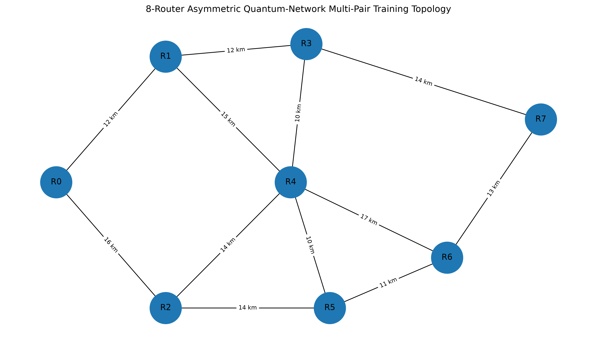
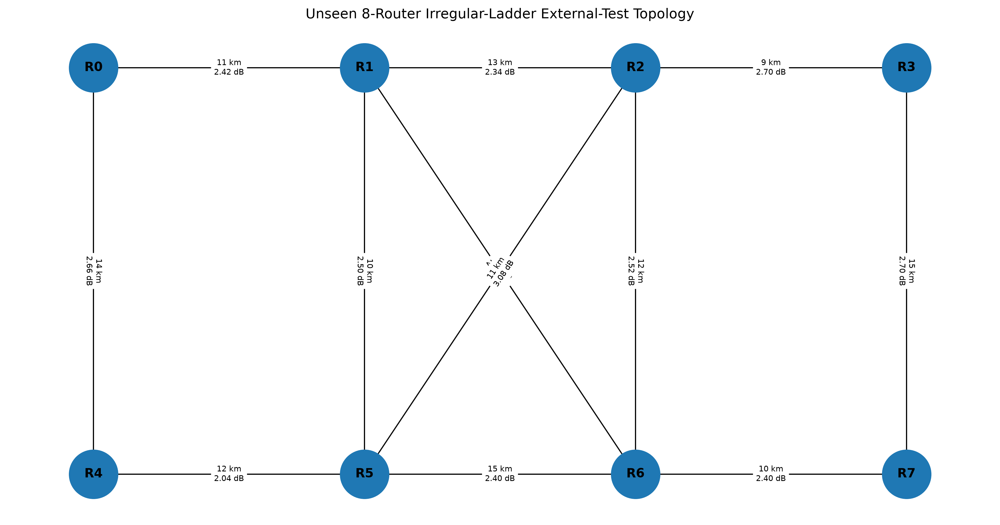
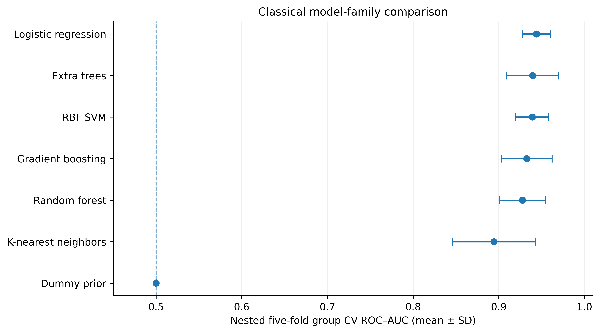
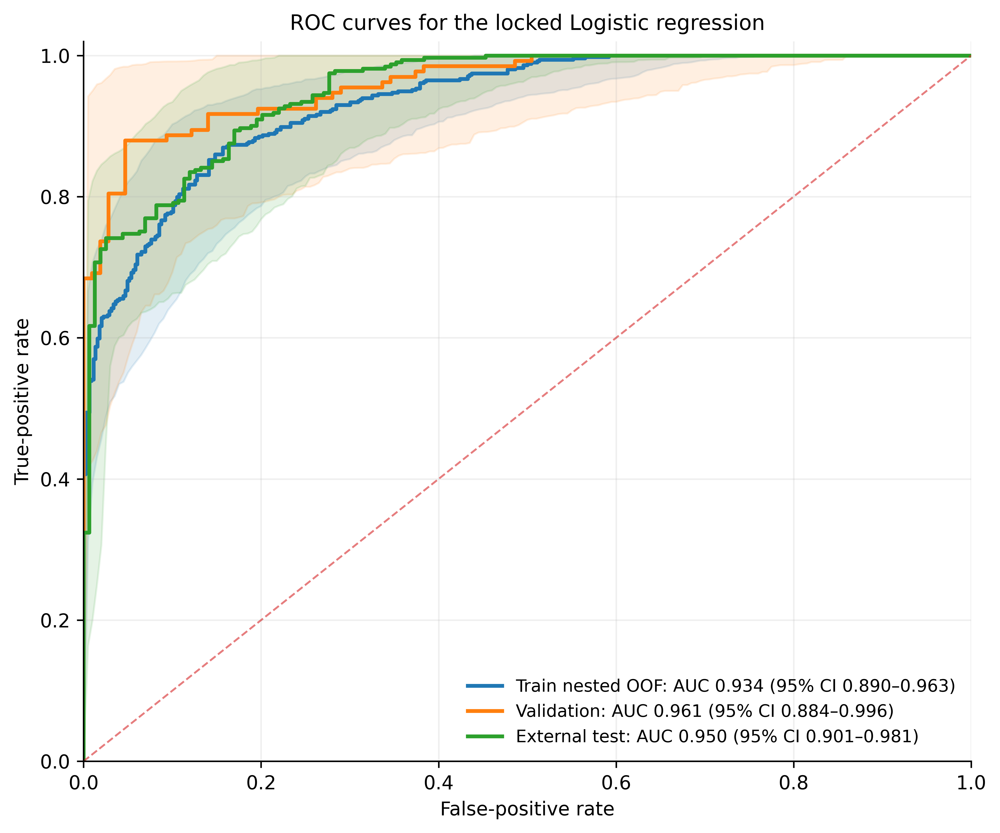
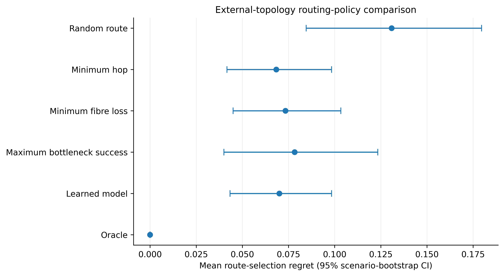
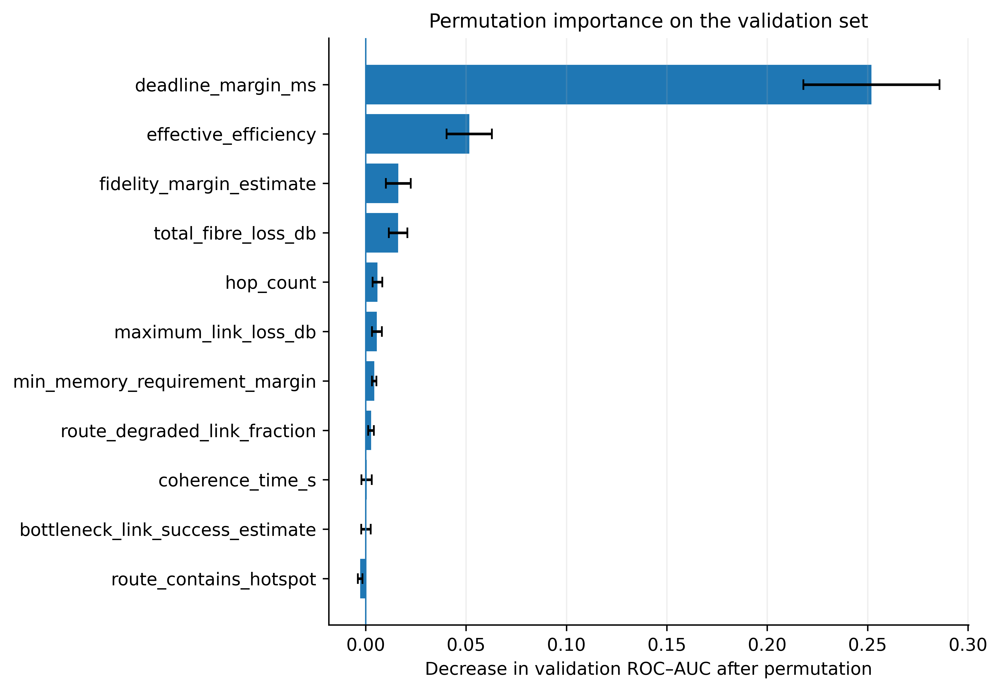
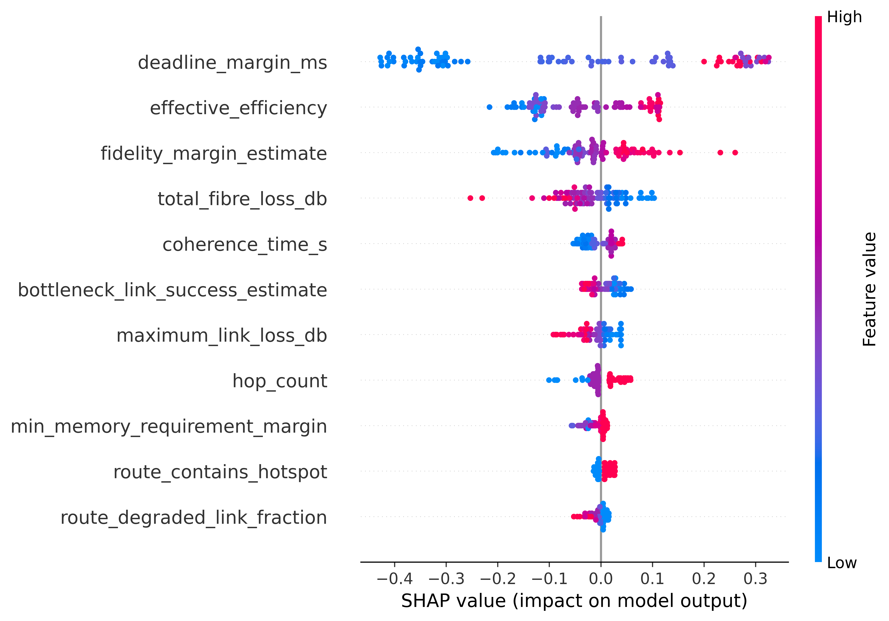

# Physics-Informed Machine Learning for Quantum-Network Routing

This repository presents a reproducible **SeQUeNCe-based quantum-network routing framework** for:

1. predicting whether a candidate route can satisfy an end-to-end entanglement request; and
2. selecting high-quality routes under changing loss, memory, fidelity, deadline, and congestion conditions.

The study uses an **8-router quantum network**, physics-informed route features, leakage-safe nested group cross-validation, and evaluation on a structurally different external topology.

## Network Topologies

<table>
<tr>
<td align="center" width="50%">
<br>
<b>Development mesh topology</b>
</td>
<td align="center" width="50%">
<br>
<b>External ladder topology</b>
</td>
</tr>
</table>

The development topology is used for training and validation. The external topology is reserved for cross-topology evaluation.

## Dataset

Each network scenario contains four endpoint pairs and four candidate routes per pair. Route outcomes are estimated from five stochastic simulation rollouts.

| Split         | Scenarios | Route records | Feasible routes |
| ------------- | --------: | ------------: | --------------: |
| Training      |        60 |           960 |           53.5% |
| Validation    |        15 |           240 |           55.4% |
| External test |        30 |           480 |           66.9% |

A route is labeled feasible when its observed success probability is at least **0.60**.

## Methodology

The learning pipeline uses 11 pre-routing, physics-informed features, including:

* hop count and fibre loss;
* bottleneck link-success estimate;
* memory, fidelity, and deadline margins;
* degraded-link fraction and hotspot status;
* effective efficiency and coherence time.

Seven classical classifiers are evaluated using **5-fold outer / 4-fold inner nested `StratifiedGroupKFold`**, grouped by simulation scenario to prevent leakage.

The final classifier is refitted on the development data after validation-based threshold selection and evaluated once on the external topology.

## Main Classification Results

Nested validation selected **Logistic Regression** as the numerically strongest model, while Extra Trees and RBF-SVM showed statistically comparable discrimination.

| Metric                             |        Result |
| ---------------------------------- | ------------: |
| Nested-CV ROC–AUC                  | 0.944 ± 0.017 |
| External ROC–AUC                   |     **0.950** |
| External ROC–AUC 95% CI            |   0.901–0.981 |
| External balanced accuracy         |     **0.854** |
| External F1-score                  |     **0.905** |
| External MCC                       |     **0.712** |
| Moderate-scenario external ROC–AUC |     **0.843** |

<p align="center">


</p>

## Routing-Policy Evaluation

The learned policy is compared with uniform random selection, deterministic routing heuristics, and an oracle upper bound.

| Routing policy             | Mean regret ↓ | Feasible selected ↑ | Tie-aware top-1 ↑ |
| -------------------------- | ------------: | ------------------: | ----------------: |
| Random route               |        0.1308 |              0.6688 |            0.6333 |
| Minimum hop                |    **0.0683** |              0.7667 |            0.7167 |
| Minimum fibre loss         |        0.0733 |          **0.7750** |            0.7000 |
| Maximum bottleneck success |        0.0783 |              0.7417 |        **0.7667** |
| Learned model              |        0.0700 |              0.7667 |            0.7000 |
| Oracle                     |        0.0000 |              0.8167 |            1.0000 |

The learned model reduced mean regret by approximately **46.5% relative to random routing**. Its performance was statistically comparable to the deterministic heuristics, but it did not demonstrate significant superiority over them.

<p align="center">

</p>

## Explainability

Permutation importance and SHAP analysis identify **deadline margin** as the dominant predictor, followed by effective efficiency, fidelity margin, and total fibre loss.

<p align="center">


</p>

## Repository Structure

```text
sequence-quantum-routing-ml/
├── Data/
│   ├── model_ready_train.csv
│   ├── model_ready_validation.csv
│   ├── model_ready_external_test.csv
│   └── route_level_dataset (1).csv
│
├── Simulation/
│   ├── SeQUeNCE_8Node_Route_Dataset_Simulation.ipynb
│   ├── Figures/
│   └── manifests/
│
└── Machine_learning/
    ├── Classical_ML_With_Routing_Baselines.ipynb
    ├── Figures/
    ├── tables/
    └── explainability/
```

### Key files

* [Simulation notebook](Simulation/SeQUeNCE_8Node_Route_Dataset_Simulation.ipynb)
* [Classical ML notebook](Machine_learning/Classical_ML_With_Routing_Baselines.ipynb)
* [Training dataset](Data/model_ready_train.csv)
* [Validation dataset](Data/model_ready_validation.csv)
* [External-test dataset](Data/model_ready_external_test.csv)
* [Model-comparison results](Machine_learning/tables/nested_model_comparison.csv)
* [External routing-policy table](Machine_learning/tables/paper_external_routing_baseline_table.csv)
* [Metrics with 95% confidence intervals](Machine_learning/tables/metrics_with_scenario_bootstrap_95ci.csv)

## Reproducing the ML Experiment

1. Open `Machine_learning/Classical_ML_With_Routing_Baselines.ipynb` in Google Colab.
2. Upload the three model-ready CSV files or update the dataset paths.
3. Confirm the final-run settings:

```python
FAST_MODE = False
RUN_EXPLAINABILITY = True
RESET_OUTPUT_DIR = True
```

4. Select **Runtime → Run all**.

The notebook performs data auditing, nested grouped model selection, validation-only threshold locking, external evaluation, scenario-level bootstrap confidence intervals, deterministic routing comparisons, SHAP, LIME, and permutation importance.

## Scope

This repository provides an **8-node simulation-based proof of concept**. The results demonstrate strong cross-topology feasibility prediction, while also showing that simple physics-based routing heuristics remain competitive.

Quantum machine-learning models and larger network topologies are planned as future extensions.
